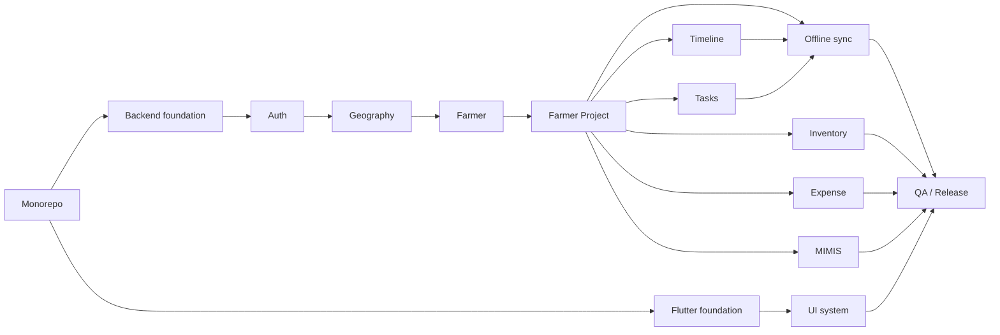

# AgriFlow OS — Implementation Plan

**Version:** 1.0  
**Status:** Phase 1 execution roadmap (documentation only)  
**Last updated:** 2026-05-20  

**Related documents:** [PRD.md](./PRD.md) · [ARCHITECTURE.md](./ARCHITECTURE.md) · [DOCTYPES.md](./DOCTYPES.md) · [API_CONTRACTS.md](./API_CONTRACTS.md) · [UI_TOKENS.md](./UI_TOKENS.md) · [.cursorrules](./.cursorrules)

---

## Executive summary

AgriFlow OS Phase 1 delivers a **workflow-first, offline-first** mobile operations platform for a single irrigation subsidy dealer (Tiruvannamalai, 12 blocks, ~15 users). Delivery follows **backend-before-screens**, **timeline-first UX**, and **sync-as-infrastructure** principles.

| Dimension | Approach |
|-----------|----------|
| Duration estimate | 16–22 weeks (1–2 engineers + part-time owner UAT) |
| Critical path | Geography → Farmer Project + lifecycle service → Timeline UI → Sync engine |
| Defer | AI (PRD §16), lead ecosystem (ARCHITECTURE §21), dark mode, SaaS multi-tenant |
| First usable milestone | Field staff can view project timeline offline after M8 + M9 + M11 (partial sync) |

---

## Table of contents

### Philosophy & phases (1–15)

1. [Implementation philosophy](#1-implementation-philosophy)  
2. [Phase 2 — Monorepo setup](#phase-2--monorepo-setup)  
3. [Phase 3 — Backend foundation](#phase-3--backend-foundation)  
4. [Phase 4 — Flutter foundation](#phase-4--flutter-foundation)  
5. [Phase 5 — Authentication](#phase-5--authentication)  
6. [Phase 6 — Geography master](#phase-6--geography-master)  
7. [Phase 7 — Farmer module](#phase-7--farmer-module)  
8. [Phase 8 — Farmer Project](#phase-8--farmer-project)  
9. [Phase 9 — Timeline engine](#phase-9--timeline-engine)  
10. [Phase 10 — Task engine](#phase-10--task-engine)  
11. [Phase 11 — Offline sync](#phase-11--offline-sync)  
12. [Phase 12 — Inventory](#phase-12--inventory)  
13. [Phase 13 — Expense / profit](#phase-13--expense--profit)  
14. [Phase 14 — MIMIS reconciliation](#phase-14--mimis-reconciliation)  
15. [Phase 15 — UI system implementation](#phase-15--ui-system-implementation)  

### Operations (16–30)

16. [QA / testing strategy](#16-qatesting-strategy)  
17. [Dev / staging / prod environments](#17-dev--staging--prod-environments)  
18. [Docker / Coolify deployment milestones](#18-docker--coolify-deployment-milestones)  
19. [Data migration strategy](#19-data-migration-strategy)  
20. [Fixture strategy](#20-fixture-strategy)  
21. [Security checklist](#21-security-checklist)  
22. [Performance checklist](#22-performance-checklist)  
23. [Release strategy](#23-release-strategy)  
24. [Rollback strategy](#24-rollback-strategy)  
25. [Observability / logging strategy](#25-observability--logging-strategy)  
26. [Backup / recovery strategy](#26-backup--recovery-strategy)  
27. [Team workflow](#27-team-workflow)  
28. [Git branch strategy](#28-git-branch-strategy)  
29. [Cursor AI usage guidelines](#29-cursor-ai-usage-guidelines)  
30. [Phase completion criteria](#30-phase-completion-criteria)  

---

## 1. Implementation philosophy

### 1.1 Core tenets

| Tenet | Execution rule |
|-------|----------------|
| **Backend before screens** | No Flutter business screen until matching API + DocType exist and are smoke-tested |
| **Timeline-first delivery** | First “wow” milestone = project timeline with real stage history |
| **Offline-first mandatory** | SyncQueue + `sync.push`/`pull` are infrastructure, not a late add-on |
| **Farmer Project = aggregate root** | All features link to project lifecycle; no parallel workflow engines |
| **Iterative milestones** | Ship thin vertical slices end-to-end every 2–3 weeks |
| **Fixtures over hardcoding** | Stages, geography, roles from versioned fixtures |
| **No premature AI** | PRD Phase 1: zero AI features |
| **Avoid overengineering** | One Frappe app, one mobile app, no microservices |
| **Future extensibility** | Follow ARCHITECTURE §21 placeholders only — do not implement leads/SaaS in Phase 1 |

### 1.2 Delivery rhythm

```
Week N:   Backend DocType + service + API
Week N+1: Mobile repository + provider + screen (online)
Week N+2: Offline queue + delta pull + UAT slice
```

### 1.3 Definition of “done” (global)

- DocType matches [DOCTYPES.md](./DOCTYPES.md)  
- API matches [API_CONTRACTS.md](./API_CONTRACTS.md)  
- UI uses [UI_TOKENS.md](./UI_TOKENS.md) + i18n (en + ta)  
- Role permissions enforced server-side  
- Audit log for sensitive mutations  
- Validation checklist for phase signed off  

### 1.4 Complexity legend

| Rating | Meaning |
|--------|---------|
| **L** | Low — 2–4 person-days |
| **M** | Medium — 1–2 person-weeks |
| **H** | High — 2–3 person-weeks |
| **VH** | Very high — 3+ person-weeks, critical path |

---

## Phase 2 — Monorepo setup

### Goals

- Establish repository layout per [ARCHITECTURE.md §1](./ARCHITECTURE.md#1-monorepo-structure)  
- CI skeleton, editor config, documentation index  
- No production business logic yet  

### Dependencies

- None (project start)  
- PRD + architecture docs approved  

### Risks

| Risk | Mitigation |
|------|------------|
| Repo structure drift | Lock `ARCHITECTURE.md` monorepo tree; PR template checklist |
| Missing license/env templates | Add `.env.example`, `README.md` bootstrap |

### Deliverables

- [ ] Git repository initialized  
- [ ] Folder scaffold: `apps/agriflow/`, `mobile/agriflow_mobile/`, `infra/`, `docs/`  
- [ ] `.cursorrules` + doc cross-links in README  
- [ ] `.gitignore` (Python, Flutter, Frappe, secrets)  
- [ ] EditorConfig + optional pre-commit (lint/format stubs)  
- [ ] GitHub/GitLab CI: docs lint + placeholder jobs for bench/analyze  

### Validation checklist

- [ ] Clone → README explains how to open bench and Flutter paths  
- [ ] No secrets committed  
- [ ] All six docs linked from README  

### Estimated complexity

**L**

---

## Phase 3 — Backend foundation

### Goals

- Frappe v15 custom app `agriflow` on bench (Docker local)  
- MariaDB 11, Redis 7 wired  
- Module stubs M1–M9, hooks, API namespace `agriflow.api.v1`  
- AgriFlow Audit Log DocType skeleton  

### Dependencies

- Phase 2 complete  

### Risks

| Risk | Mitigation |
|------|------------|
| Bench version mismatch | Pin versions in `infra/docker/` compose |
| Slow Windows dev | Document WSL2/Docker path per team OS |

### Deliverables

- [ ] `apps/agriflow` installable on bench  
- [ ] `hooks.py`: scheduler stubs, JWT config placeholders  
- [ ] Base API envelope helper (ok/data/error/server_time/request_id)  
- [ ] `ping` / health method for deploy checks  
- [ ] Dev site `agriflow.local` + admin user  
- [ ] Redis queue workers start locally  

### Validation checklist

- [ ] `bench migrate` clean  
- [ ] Whitelisted `ping` returns envelope  
- [ ] Modules visible in desk  
- [ ] ARCHITECTURE layer diagram reflected in package layout  

### Estimated complexity

**M**

---

## Phase 4 — Flutter foundation

### Goals

- Flutter 3.24 app shell: Riverpod, go_router, feature folders  
- Design token **structure** (empty/theme wired to UI_TOKENS)  
- i18n scaffold (en, ta) — no business screens  
- Drift + Hive bootstrap; SyncQueue table schema only  
- Dio client + envelope parser + interceptors (no domain APIs)  

### Dependencies

- Phase 2 complete  
- Phase 3 in progress (envelope contract stable)  

**Note:** Flutter starts in parallel with backend foundation but **no business screens** until Phase 5+.

### Risks

| Risk | Mitigation |
|------|------------|
| Codegen drift | Pin build_runner/drift versions in pubspec |
| Token doc vs code mismatch | Single PR updates UI_TOKENS + token files |

### Deliverables

- [ ] `lib/app/`: bootstrap, router shells (placeholder routes)  
- [ ] `lib/core/`: design_tokens, network, database, sync (skeleton)  
- [ ] ARB files `app_en.arb`, `app_ta.arb` with core keys  
- [ ] Theme: Material 3 light from UI_TOKENS semantics  
- [ ] App bar sync chip placeholder (static)  
- [ ] Integration test: app launches  

### Validation checklist

- [ ] `flutter analyze` clean  
- [ ] Locale switch ta/en works on placeholder screen  
- [ ] No hardcoded colors (lint rule or review)  
- [ ] Router uses go_router only  

### Estimated complexity

**M**

---

## Phase 5 — Authentication

### Goals

- JWT login / refresh / logout per [API_CONTRACTS.md §3–4](./API_CONTRACTS.md#3-authentication-flow)  
- Role + block permission manifest on login  
- Mobile secure token storage + auth guard routes  

### Dependencies

- Phase 3 (API envelope, Frappe users/roles)  
- Phase 4 (Dio, router, secure storage)  

### Risks

| Risk | Mitigation |
|------|------------|
| Token leakage | Secure storage; no tokens in logs |
| Refresh rotation bugs | Integration tests for refresh + 401 retry |

### Deliverables

- [ ] `auth.login`, `auth.refresh`, `auth.logout`, `auth.permissions`  
- [ ] Frappe roles: Owner, Office Manager, Office Staff, Field Staff, Installer, Service Tech, Store Keeper  
- [ ] JWT claims: roles, districts, blocks  
- [ ] Mobile: `auth` feature — login screen, session provider, route guards  
- [ ] Permission manifest cached in Hive  

### Validation checklist

- [ ] Field Staff login receives scoped `blocks[]`  
- [ ] Expired access token refreshes once  
- [ ] Logout invalidates refresh server-side  
- [ ] `min_mobile_version` enforced on login  

### Estimated complexity

**M**

---

## Phase 6 — Geography master

### Goals

- P0 geography DocTypes + fixtures (Tiruvannamalai, 12 blocks)  
- Master APIs: districts, blocks, clusters, villages, officers, assignments  
- Mobile Hive cache + master pull on login  

### Dependencies

- Phase 3, 5  

### Risks

| Risk | Mitigation |
|------|------------|
| Bad village/cluster data | Owner validates fixture CSV before import |
| Large village payload | Cursor pagination on `master.villages` |

### Deliverables

- [ ] DocTypes: District, Block, Cluster, Village, Officer, Officer Assignment History  
- [ ] Fixtures: `district_seed.json`, blocks, clusters, villages, officers  
- [ ] APIs per [API_CONTRACTS.md §19](./API_CONTRACTS.md#19-geography-master-apis)  
- [ ] User Permission templates by block  
- [ ] Mobile: master repository, Hive boxes, pull on login  
- [ ] Desk: optional CSV import for villages  

### Validation checklist

- [ ] Hierarchy validation: village → cluster → block → district  
- [ ] Officer assignment append-only transfer tested  
- [ ] Field Staff API cannot read out-of-scope block  
- [ ] Mobile offline: filters work from Hive snapshot  

### Estimated complexity

**H**

---

## Phase 7 — Farmer module

### Goals

- Farmer DocType (M1) + CRUD APIs  
- Mobile farmer list, detail, create (online first)  
- `client_id` idempotency on create  

### Dependencies

- Phase 6 (geography links)  
- Phase 5 (auth)  

### Risks

| Risk | Mitigation |
|------|------------|
| PII handling | aadhaar_last4 only; mask mobile in lists |
| Duplicate farmers | Unique mobile per district rule |

### Deliverables

- [ ] Farmer DocType + optional Farmer Land Parcel child  
- [ ] `farmer.list`, `farmer.get`, `farmer.create`, `farmer.update`  
- [ ] Mobile `farmer_registry` feature: list, detail, create form (step sheet)  
- [ ] Drift `farmers` table + mappers  

### Validation checklist

- [ ] Create farmer with village/block validation  
- [ ] Duplicate `client_id` returns same farmer  
- [ ] i18n labels ta/en on forms  
- [ ] List scoped to user blocks  

### Estimated complexity

**M**

---

## Phase 8 — Farmer Project

### Goals

- **Aggregate root** DocType + `ProjectLifecycleService`  
- 12-stage fixture + sequential transition rules  
- Project Stage History (append-only child)  
- APIs: list, get, create, update, transition  

### Dependencies

- Phase 6, 7  
- Phase 3 services layer  

### Risks

| Risk | Mitigation |
|------|------------|
| Stage skip bugs | Unit test all 12 transitions + rejection cases |
| One-active-project rule | DB constraint + validation |
| Role matrix complexity | Fixture `project_stage_role_matrix.json` |

### Deliverables

- [ ] Farmer Project DocType per [DOCTYPES.md §2](./DOCTYPES.md#2-farmer-project)  
- [ ] Project Stage History child table  
- [ ] `ProjectLifecycleService.transition()`  
- [ ] `project.list`, `project.get`, `project.create`, `project.update`, `project.transition`  
- [ ] Audit log on transition  
- [ ] Mobile: project list (no timeline yet), create project flow  

### Validation checklist

- [ ] Cannot skip stages  
- [ ] Cannot transition cancelled project  
- [ ] Pre/post inspection roles enforced (Office Manager)  
- [ ] Initial history row on create (`lead_captured`)  
- [ ] `doc_version` increments on transition  

### Estimated complexity

**VH** (critical path)

---

## Phase 9 — Timeline engine

### Goals

- **`project.timeline` API** — history, open tasks placeholder, next stage workflow  
- Mobile **timeline-first** project detail screen (dominant UI)  
- Stage chips, next action CTA, attachment placeholders  

### Dependencies

- Phase 8 (project + history)  
- Phase 4 (tokens), Phase 15 can refine visuals in parallel  

### Risks

| Risk | Mitigation |
|------|------------|
| Timeline clutter | UI_TOKENS: 50% viewport, max 1 primary CTA |
| Tamil overflow | 2-line chips, Noto 16sp minimum |

### Deliverables

- [ ] `project.timeline` per [API_CONTRACTS.md §15](./API_CONTRACTS.md#15-timeline-api-contracts)  
- [ ] Mobile `project_lifecycle`: timeline screen, stage chip, transition sheet  
- [ ] Transition confirm dialog (from → to i18n)  
- [ ] Navigation deep link `/projects/:id/timeline`  

### Validation checklist

- [ ] Timeline renders 12 stages with correct completed/current/future  
- [ ] Next action panel shows `workflow.next_stage` from API  
- [ ] Transition success refreshes timeline  
- [ ] Stale transition shows refresh UX (prep for sync phase)  
- [ ] Meets UI_TOKENS timeline dominance rule  

### Validation checklist (UAT)

- [ ] Office Manager completes happy path 1→4 in desk or mobile  
- [ ] Field staff understands next action without training doc  

### Estimated complexity

**H**

---

## Phase 10 — Task engine

### Goals

- Task DocType + task_template fixture (auto-create on stage entry)  
- Task APIs + mobile task list/complete  
- Background job `generate_stage_tasks`  

### Dependencies

- Phase 8 (transition triggers tasks)  
- Phase 9 (timeline shows open tasks)  

### Risks

| Risk | Mitigation |
|------|------------|
| Task spam on transition | Template rules per stage only |
| Overdue noise | Priority + due_date filters |

### Deliverables

- [ ] Task DocType + task_template fixture  
- [ ] `generate_stage_tasks` scheduler hook  
- [ ] `task.list`, `task.get`, `task.create`, `task.update`, `task.complete`  
- [ ] Mobile `tasks` feature: list, detail, complete with visit_outcome  
- [ ] Timeline integrates `open_tasks` from timeline API  

### Validation checklist

- [ ] Transition to stage 5 creates expected template tasks  
- [ ] Completing task does not auto-advance stage  
- [ ] Assigned user filter works for Field Staff  
- [ ] Overdue tasks visible in list sort  

### Estimated complexity

**M**

---

## Phase 11 — Offline sync

### Goals

- **Critical infrastructure:** SyncQueue, `sync.push`, `sync.pull`, conflict handling  
- Idempotency store; per-project ordering  
- Sync status UI mandatory  

### Dependencies

- Phase 7–10 (entities to sync)  
- Phase 4 (Drift queue schema)  
- [API_CONTRACTS.md §8–14](./API_CONTRACTS.md#8-offline-sync-protocol)  

**Early scaffolding:** Drift SyncQueue + envelope in Phase 4; **hardening here**.

### Risks

| Risk | Mitigation |
|------|------------|
| Data loss | Never drop queue without ack; persistent Drift |
| Conflict confusion | Standard conflict objects + Tamil i18n messages |
| Stage transition races | Server authoritative + refresh timeline |

### Deliverables

- [ ] Server: `sync.push`, `sync.pull`, idempotency table, op dependency order  
- [ ] Server: conflict responses per §14  
- [ ] Mobile: SyncWorker, ConflictResolver, connectivity listener  
- [ ] Mobile: queue farmer, project, task creates/updates  
- [ ] App bar sync chip + sync detail sheet (UI_TOKENS §26)  
- [ ] Integration tests: offline create → push → pull  

### Validation checklist

- [ ] Airplane mode: create farmer + project → queue → sync on reconnect  
- [ ] Duplicate `client_id` does not duplicate records  
- [ ] Stale `project.transition` returns conflict + timeline refresh  
- [ ] Master data pull overwrites Hive (server wins)  
- [ ] LWW task update with `doc_version`  
- [ ] Pending count visible always  

### Estimated complexity

**VH** (critical path)

---

## Phase 12 — Inventory

### Goals

- P1: Inventory Item, Stock Entry (+ lines)  
- 2-godown fixture; Store Keeper APIs  
- Mobile stock issue linked to project (stage ≥ 9)  

### Dependencies

- Phase 8 (farmer_project link)  
- Phase 11 (optional push for stock — online-first acceptable initially)  

### Risks

| Risk | Mitigation |
|------|------------|
| Negative stock | Validation stub Phase 1; bin ledger Phase 1.5 if needed |
| Store Keeper scope | Role isolation from farmer PII export |

### Deliverables

- [ ] Inventory Item DocType + godown fixture  
- [ ] Stock Entry DocType + child lines  
- [ ] `inventory.items`, `inventory.stock_entry.create`, `inventory.stock_entry.list`  
- [ ] Mobile `inventory` feature (Store Keeper shell)  
- [ ] Audit on stock mutations  

### Validation checklist

- [ ] Issue to project at stage 9+  
- [ ] Transfer between godown_1 and godown_2  
- [ ] Store Keeper cannot access farmer mobile full export  

### Estimated complexity

**M**

---

## Phase 13 — Expense / profit

### Goals

- Expense Entry DocType; rollup to `Farmer Project.total_expense`  
- Owner/Office profit visibility (basic report or screen)  
- APIs + mobile create (sync via queue)  

### Dependencies

- Phase 8, 11  

### Risks

| Risk | Mitigation |
|------|------------|
| Incorrect rollup | Nightly recompute job + transition hook |
| Currency precision | Decimal field; tabular figures in UI |

### Deliverables

- [ ] Expense Entry DocType  
- [ ] `expense.list`, `expense.create`, `expense.update`  
- [ ] `compute_profit_snapshot` nightly job (basic)  
- [ ] Mobile expense capture from project detail  
- [ ] Owner dashboard v0: project list with expense totals  

### Validation checklist

- [ ] Expense increases project total  
- [ ] Owner sees block-level summary  
- [ ] Offline expense queues and syncs  

### Estimated complexity

**M**

---

## Phase 14 — MIMIS reconciliation

### Goals

- Excel-only MIMIS pipeline (no portal)  
- Import batch + reconciliation rows + approval → optional stage 4  
- Office Manager desk/mobile upload + report  

### Dependencies

- Phase 8 (stage 3→4 gate)  
- Phase 3 (long queue job), MinIO file storage  

### Risks

| Risk | Mitigation |
|------|------------|
| Bad Excel format | Template version + strict column validation |
| Auto stage without approval | Human approval required (ARCHITECTURE §13) |

### Deliverables

- [ ] MIMIS Import Batch, MIMIS Reconciliation Row DocTypes  
- [ ] `process_mimis_import` background job  
- [ ] APIs: upload_excel, batch_status, reconciliation_report, approve_row, reject_row  
- [ ] Excel template in `packages/excel_templates/`  
- [ ] Mobile/desk upload UI (online only)  
- [ ] Audit on approve/reject  

### Validation checklist

- [ ] Duplicate file_hash rejected  
- [ ] Match by registration number works  
- [ ] Approve advances project only from stage 3  
- [ ] No offline MIMIS processing claimed  

### Estimated complexity

**H**

---

## Phase 15 — UI system implementation

### Goals

- Complete token implementation parity with [UI_TOKENS.md](./UI_TOKENS.md)  
- Role-based shells, bottom nav, empty/loading/error states  
- Polish timeline, chips, forms — no ERP patterns  

### Dependencies

- Phases 4–14 (screens exist to polish)  
- Can start token work in Phase 4; **closure here**  

### Risks

| Risk | Mitigation |
|------|------------|
| Inconsistent widgets | Shared `shared/widgets` library |
| Sunlight readability | Outdoor UAT on mid-range Android |

### Deliverables

- [ ] All semantic colors, typography, spacing in code  
- [ ] Timeline, chips, buttons, inputs per spec  
- [ ] Role-based bottom nav (Field, Office, Store, Owner)  
- [ ] Empty/loading/error/sync states wired globally  
- [ ] Tamil QA pass on all Phase 1 screens  

### Validation checklist

- [ ] Design invariants §33 UI_TOKENS satisfied  
- [ ] Touch targets ≥ 44dp measured  
- [ ] Sync chip on all authenticated screens  
- [ ] No hardcoded Tamil in Dart  

### Estimated complexity

**M** (spread across project; consolidation **M**)

---

## 16. QA / testing strategy

### 16.1 Test pyramid

| Layer | Scope | Tools |
|-------|--------|-------|
| Unit | `ProjectLifecycleService`, conflict resolver, validators | pytest / flutter test |
| Integration | API envelope, auth, sync.push/pull | pytest + httpx; flutter integration |
| E2E | Login → create farmer → project → transition → sync | patrol or integration driver |
| UAT | 15 user roles, 12 blocks sample data | Owner + 2 staff weekly |

### 16.2 Critical test cases (must pass before prod)

- [ ] 12-stage sequential transition matrix  
- [ ] Officer assignment transfer append-only  
- [ ] Offline queue flush + idempotency  
- [ ] Stale transition conflict  
- [ ] MIMIS approve stage gate  
- [ ] RBAC block scope  

### 16.3 Test data

- Fixture district TVM + 2 blocks minimal for CI  
- Full 12-block dataset for staging UAT  

### 16.4 Regression

- Tag release candidates `v1.0.0-rc.N`  
- Run full matrix on RC before prod  

---

## 17. Dev / staging / prod environments

| Environment | Purpose | Data |
|-------------|---------|------|
| **dev** | Local bench + emulator | Synthetic / fixture |
| **staging** | Coolify on Hetzner | Anonymized or copy with PII masked |
| **prod** | Coolify on Hetzner | Live dealer data |

### Per-environment config

| Variable | dev | staging | prod |
|----------|-----|---------|------|
| Site URL | `agriflow.local` | `staging.agriflow.*` | `app.agriflow.*` |
| JWT secret | dev only | unique | unique |
| MinIO bucket | dev | staging | prod |
| Log level | DEBUG | INFO | INFO |

### Validation

- [ ] Staging mirrors prod compose topology  
- [ ] No prod credentials in repo  

---

## 18. Docker / Coolify deployment milestones

| Milestone | Deliverable |
|-----------|-------------|
| D1 | `docker-compose` local: MariaDB, Redis, frappe, minio |
| D2 | Production compose: Caddy TLS, frappe, workers, scheduler |
| D3 | Coolify app deploy staging |
| D4 | Coolify app deploy prod + health check `ping` |
| D5 | MinIO bucket backups configured |
| D6 | Evolution API (optional) for WhatsApp reminders |

### Validation checklist

- [ ] `bench migrate` in deploy pipeline  
- [ ] Worker + scheduler containers running  
- [ ] SSL auto-renew  
- [ ] Rollback image tag documented (§24)  

---

## 19. Data migration strategy

### Phase 1 scope

- Greenfield — no legacy ERP cutover  
- Import geography + officers from CSV fixtures  
- Optional: import existing farmer spreadsheet → Farmer DocType via CSV import tool  

### Migration patches

- Frappe patches in `apps/agriflow/patches/`  
- One patch per schema change; never manual SQL in prod  

### Future

- Multi-district: add `District` link on Block via patch + backfill TVM  

### Validation

- [ ] Patch dry-run on staging copy  
- [ ] Roll-forward only; compensating patches for fixes  

---

## 20. Fixture strategy

| Fixture | When loaded |
|---------|-------------|
| Roles & permissions | Phase 5 |
| project_stage (12) | Phase 8 |
| task_template | Phase 10 |
| district_seed, blocks, clusters, villages | Phase 6 |
| officers, assignments | Phase 6 |
| godown, expense_category | Phase 12–13 |

### Rules

- Export from staging after UAT approval → commit JSON to `fixtures/`  
- `bench migrate` + `bench import-doc` in deploy  
- Version fixture folder in tag `fixtures-v1.0.0`  

### Validation

- [ ] Fresh site + import = working login + stages  
- [ ] Fixture change triggers changelog entry  

---

## 21. Security checklist

| Item | Phase |
|------|-------|
| JWT short TTL + refresh rotation | 5 |
| User Permission block scope | 6 |
| Server-side RBAC on every API | All |
| No PII in logs | All |
| File MIME validation | 12, 14 |
| TLS everywhere | D4 |
| Secrets in Coolify env | D3 |
| Account lockout on login | 5 |
| Audit log for stage/MIMIS/stock/expense | 8+ |
| `min_mobile_version` | 5 |
| Dependency scan (pip/npm) | CI |

---

## 22. Performance checklist

| Target (ARCHITECTURE §19) | Verify |
|---------------------------|--------|
| `project.list` p95 < 300ms | Load test 25 rows |
| `project.timeline` p95 < 400ms | |
| `sync.push` 50 ops p95 < 2s | |
| Mobile cold start < 3s | Profile release build |
| Master pull < 5s | 12 blocks full villages |

### Mobile

- [ ] Timeline scroll 60fps mid-range device  
- [ ] Drift queries indexed  
- [ ] Image upload compressed client-side  

---

## 23. Release strategy

### Versioning

| Component | Scheme |
|-----------|--------|
| Mobile | `MAJOR.MINOR.PATCH+BUILD` |
| API | `v1` until breaking change |
| Fixtures | git tag with release |

### Release train

1. Feature complete on `develop`  
2. RC to staging → UAT sign-off (Owner)  
3. `main` tag `v1.0.0` → prod deploy  
4. Mobile AAB to internal track → phased staff rollout (4 → 8 → 15 users)  

### Communication

- Tamil + English release notes (i18n keys changelog)  
- 30-min staff demo per role  

---

## 24. Rollback strategy

| Layer | Rollback |
|-------|----------|
| Mobile | Prior AAB in internal track; `min_mobile_version` not bumped until stable |
| API | Docker image previous tag; DB patch reverse only if forward patch exists |
| DB | Restore MariaDB snapshot from backup (last 24h RPO) |
| Fixtures | Re-import previous fixture tag |

### Rules

- No destructive migration without backup  
- Test rollback on staging quarterly  

---

## 25. Observability / logging strategy

| Signal | Implementation |
|--------|----------------|
| API errors | Structured JSON logs + `request_id` |
| Sync failures | Log `op_id`, `client_id`, entity |
| Jobs | MIMIS batch start/complete/fail |
| Mobile crashes | Crashlytics (Phase 1 optional, recommended) |
| Uptime | Health `ping` + external monitor |

### Dashboards (minimal Phase 1)

- Error rate by endpoint  
- Sync conflict count  
- MIMIS batch failures  

### No PII in logs

- Mask mobile; no full farmer names in DEBUG production  

---

## 26. Backup / recovery strategy

| Asset | Frequency | Target |
|-------|-----------|--------|
| MariaDB | Daily | Backblaze B2 |
| MinIO | Daily incremental | B2 |
| Redis | Optional RDB | — |

| Metric | Target |
|--------|--------|
| RPO | 24 hours |
| RTO | 4 hours |

### Validation

- [ ] Quarterly restore drill to staging  
- [ ] Document restore runbook in `docs/ops/`  

---

## 27. Team workflow

| Ceremony | Frequency |
|----------|-----------|
| Milestone planning | Every 2 weeks |
| Demo to Owner | End of milestone |
| Architecture review | Before Phase 8, 11, 14 |
| Doc update PR | Same PR as schema/API change |

### Roles (typical)

| Role | Responsibility |
|------|----------------|
| Backend engineer | Frappe, APIs, jobs |
| Mobile engineer | Flutter, sync, UI |
| Owner | UAT, fixture validation, Tamil copy |
| DevOps | Coolify, backups (can be engineer Phase 1) |

---

## 28. Git branch strategy

```
main          ← production releases only
develop       ← integration
feat/*        ← feature branches
fix/*         ← hotfixes → cherry-pick to main
release/*     ← RC stabilization
```

### Rules

- PR required to `develop`  
- `main` only from `release/*` after UAT  
- Conventional commits: `feat:`, `fix:`, `docs:`, `chore:`  
- No force-push `main`  

---

## 29. Cursor AI usage guidelines

### When to use

- Scaffold boilerplate matching `.cursorrules`  
- Generate tests from DOCTYPES/API specs  
- Refactor with explicit file scope  
- Documentation updates across linked docs  

### When not to use

- Inventing stages, fields, or APIs not in docs  
- Bypassing SyncQueue for mobile writes  
- Hardcoding Tamil or colors  
- Implementing ARCHITECTURE §21 future features  

### Prompt discipline

1. Attach PRD + relevant spec (`@DOCTYPES.md`, `@API_CONTRACTS.md`)  
2. State phase number and acceptance criteria  
3. Request minimal diff; one feature per session  
4. Run `analyze` / `pytest` after generation — human verifies  

### Review checklist for AI-generated PRs

- [ ] Matches DOCTYPES field names (snake_case)  
- [ ] API envelope consistent  
- [ ] Riverpod + go_router only  
- [ ] No AI features  
- [ ] Audit + permissions considered  

---

## 30. Phase completion criteria

### Phase 1 product complete (go-live)

| Criterion | Evidence |
|-----------|----------|
| P0 DocTypes live | All P0 in DOCTYPES on prod |
| 12-stage workflow | UAT script 1→12 on sample project |
| Offline field use | 8h offline test passed |
| Timeline-first UI | Owner sign-off on project screen |
| Sync visible | Sync chip + queue depth always |
| MIMIS | One real Excel reconciled |
| Inventory | 2-godown stock entry recorded |
| Expense | Project profit visible to Owner |
| Security | §21 checklist green |
| Backups | §26 restore drill done |
| Docs | Six docs match deployed behavior |

### Milestone map (suggested calendar)

| Week | Milestone | Phases |
|------|-----------|--------|
| 1–2 | Repo + bench + Flutter shell | 2, 3, 4 |
| 3 | Auth + geography | 5, 6 |
| 4–5 | Farmer + Project + lifecycle | 7, 8 |
| 6–7 | Timeline + Tasks | 9, 10 |
| 8–10 | Offline sync hardened | 11 |
| 11–12 | Inventory + Expense | 12, 13 |
| 13–14 | MIMIS + UI polish | 14, 15 |
| 15–16 | QA, staging, prod | 16–26 |
| 17–18 | Phased user rollout | 23 |

*Adjust for team size; parallelize 3+4 early, 15 ongoing.*

---

## Dependency graph (critical path)



---

## Risk register (program level)

| ID | Risk | Impact | Mitigation |
|----|------|--------|------------|
| R1 | Sync bugs in field | High | Phase 11 VH priority; dedicated test week |
| R2 | Bad geography data | Medium | Owner validates fixtures |
| R3 | Scope creep (leads, AI) | Medium | ARCHITECTURE §21 frozen Phase 1 |
| R4 | Single engineer bus factor | Medium | Docs-first; pair on sync |
| R5 | Tamil UX poor | Medium | Noto 16sp; native speaker review |
| R6 | MIMIS Excel variance | Medium | Strict template version |

---

## Document maintenance

| Event | Update |
|-------|--------|
| Phase slip | Milestone table §30 |
| New DocType | DOCTYPES + this plan phase deliverables |
| API break | API_CONTRACTS + release §23 |

---

*End of IMPLEMENTATION_PLAN.md*
