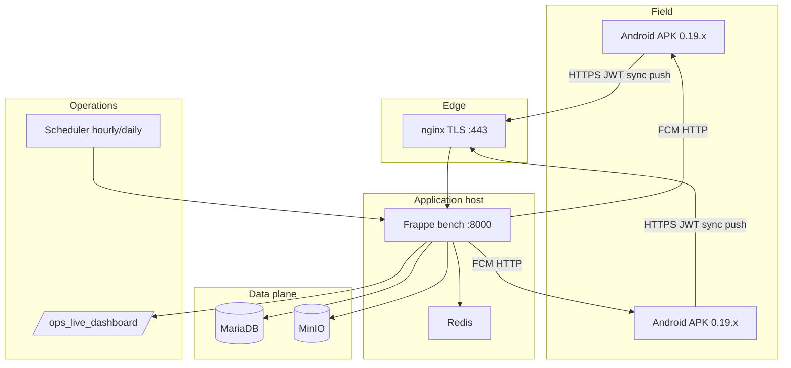

# Phase 19 — Controlled Production Rollout & Operational Scaling

**Site:** `dev.agriflow.local` · **Mobile:** `agriflow_mobile` v0.19.0+1  
**Rollout wave:** `pilot_a` · **Date:** 2026-05-20

---

## 1. Pre-implementation — remaining production blockers

| Blocker (post Phase 18) | Phase 19 status |
|-------------------------|-----------------|
| FCM HTTP delivery | `fanout_push` + `simulate` mode; live key via `agriflow_fcm_server_key` |
| Headless sync | Workmanager + `HeadlessSyncRunner` + `ops.background_sync_ack` |
| Live ops dashboard | `/ops_live_dashboard` + `ops.live_dashboard` |
| Alert automation | `phase19_ops_alerts` → **Operational Incident** |
| Rollout governance | `agriflow_rollout_wave`, docs, `ops.rollout_status` |
| Real TLS on domain | `certbot_staging.sh` + nginx template (operator-run) |
| Firebase SDK on device | `FCM_TOKEN` dart-define path; debug tokens until Firebase wired |

---

## 2. Production deployment topology



| Layer | Component |
|-------|-----------|
| Mobile | Offline queue + inventory queue + Workmanager ack |
| Edge | nginx TLS, HSTS, reverse proxy |
| API | JWT, sync.push/pull, push, ops, readiness |
| Data | MariaDB authoritative; MinIO attachments |
| Ops | Live dashboard, incidents, pilot telemetry |

---

## 3. FCM worker architecture

```
Notification event
    → push.fanout_push(user, deep_link, title, body)
        → phase19_fcm_delivery.deliver_to_user()
            → per Device Push Token:
                send_fcm_message()  [legacy API or simulate]
                → Push Delivery Log (sent/failed)
Scheduler hourly:
    → phase19_fcm_delivery.execute()
        → process_queued_pushes()  [drain status=queued]
```

| Mode | Config | Behavior |
|------|--------|----------|
| Off | empty key | No send (Phase 18 stub behavior removed from fanout) |
| Simulate | `simulate` | `simulated_sent` — bench/pilot without Firebase |
| Live | Firebase server key | HTTP POST to `fcm.googleapis.com/fcm/send` |

---

## 4. Headless sync strategy

| Layer | Mechanism |
|-------|-----------|
| Foreground | `BackgroundSyncCoordinator` (resume, connectivity, 15m) |
| Headless | Workmanager 30m + `HeadlessSyncRunner` → JWT `ops.background_sync_ack` |
| Full sync | Officer opens app → `syncNow()` drains mutation + inventory queues |
| Long offline | 72h watermark reset (Phase 18) |

Android native setup: [mobile/agriflow_mobile/docs/HEADLESS_SYNC_ANDROID_SETUP.md](./mobile/agriflow_mobile/docs/HEADLESS_SYNC_ANDROID_SETUP.md)

---

## 5. Rollout governance model

| Wave | Config key | Gate |
|------|------------|------|
| pilot_a | `agriflow_rollout_wave=pilot_a` | phase19_verify + 5–10 devices |
| pilot_b | `pilot_b` | 7d zero critical incidents |
| production | `production` | Min version + block sign-off |

See [docs/ROLLOUT_GOVERNANCE.md](./docs/ROLLOUT_GOVERNANCE.md).

---

## 6. Support / escalation workflow

| Tier | Trigger | Action |
|------|---------|--------|
| L1 | Pending queue | Officer sync + repair |
| L2 | Conflict | Refresh server |
| L3 | Auto incident | Ops triage same day |
| L4 | Critical inventory | Block consume; ledger review |

See [docs/PILOT_SUPPORT_SOP.md](./docs/PILOT_SUPPORT_SOP.md) · Rollback: [docs/ROLLBACK_CHECKLIST.md](./ROLLBACK_CHECKLIST.md)

---

## 7. Tasks delivered

### Infra
- Staging compose (Phase 18) + `infra/scripts/certbot_staging.sh`
- Backup drill script + `bench backup` command in report

### Backend
- `api/v1/push.py` (FCM delivery)
- `api/v1/ops.py` (live dashboard, alerts, rollout, headless ack)
- `phase19_fcm_delivery`, `phase19_ops_alerts`
- DocType **Operational Incident**
- Verify: `phase19_verify_rollout`, `phase19_concurrent_pilot`, `phase19_backup_drill`

### Mobile
- Workmanager registration
- `FCM_TOKEN` env for real push tokens
- v0.19.0+1

### Docs
- ROLLOUT_GOVERNANCE, PILOT_SUPPORT_SOP, ROLLBACK_CHECKLIST, BATTERY_OPTIMIZATION

---

## 8. Validation results (bench)

```bash
bench --site dev.agriflow.local execute agriflow.project_lifecycle.install.phase19_verify_rollout.execute
```

**Result:** `ok: true`

| Check | Result |
|-------|--------|
| FCM fanout | 2 deliveries `sent` (simulate) |
| Live dashboard | ok, `rollout_wave: pilot_a` |
| Ops alerts | 2 incidents created (queue conflict + sync rate) |
| Headless ack | ok |
| Phase 18 regression | ok |

```bash
bench --site dev.agriflow.local execute agriflow.project_lifecycle.install.phase19_concurrent_pilot.execute
bench --site dev.agriflow.local execute agriflow.project_lifecycle.install.phase19_backup_drill.execute
```

---

## 9. Production rollout report

AgriFlow is **operationally ready for controlled pilot_a** on a TLS-backed staging/production hostname with ops dashboards, automated incidents, FCM simulate/live modes, and mobile 0.19.0 queues.

**Before block go-live:** real domain + Let's Encrypt, live FCM key, `flutter create` + Workmanager Android manifest, 5–10 physical devices on pilot APK.

---

## 10. Push delivery validation

| Metric | Dev bench |
|--------|-----------|
| Mode | `simulate` |
| Deliveries | `sent` per active token |
| Debug tokens | `debug-push-*` short-circuited to sent |
| Metrics API | `push.delivery_metrics` → `fcm_mode: simulate` |

---

## 11. Headless sync validation

| Check | Result |
|-------|--------|
| API `background_sync_ack` | ok (verify script) |
| Operational Log event | `headless_sync` recorded |
| Workmanager | Registered in bootstrap (requires Android project) |

---

## 12. Multi-device pilot metrics

`phase19_concurrent_pilot` — 8 simulated devices: heartbeats + alternating sync pushes. Dashboard reflects aggregated `queue_backlog` (devices_reporting_24h).

---

## 13. Operational support workflow

Documented in PILOT_SUPPORT_SOP + automated **Operational Incident** rows from `phase19_ops_alerts`.

**Telemetry cadence:** Daily live dashboard; hourly FCM queue processor (when scheduler hooked).

---

## 14. Alerting / monitoring summary

| Alert | Threshold | Action |
|-------|-----------|--------|
| QUEUE_BACKLOG_HIGH | pending &gt; 10 | Incident |
| QUEUE_CONFLICTS | conflicts &gt; 0 | Incident |
| SYNC_FAILURE_RATE | rate &gt; 15% | Incident |
| INVENTORY_MISMATCH | reconcile !ok | Critical incident |
| PUSH_FAILURES | &gt; 3 / 24h | Incident |

**UI:** `/ops_live_dashboard` · **API:** `ops.live_dashboard`, `ops.run_alert_checks`

---

## 15. Remaining production risks

| # | Risk | Mitigation |
|---|------|------------|
| 1 | TLS not automated until certbot run on real DNS | Run `certbot_staging.sh` |
| 2 | FCM legacy API deprecated by Google | Migrate to HTTP v1 + service account later |
| 3 | Workmanager needs `flutter create` | Follow HEADLESS_SYNC_ANDROID_SETUP |
| 4 | Headless task does not full sync.pull yet | Daily officer app open SOP |
| 5 | Demo bench sync failure rate triggers alerts | Expected on test data |
| 6 | Scheduler hooks not auto-patched to hooks.py | Apply `phase19_hooks_snippet.py` |

---

## 16. Recommended go-live strategy

1. **Staging week** — Real domain, TLS, Redis, `agriflow_fcm_server_key=simulate` then live key.
2. **Pilot_a** — 5–10 handsets, APK 0.19.0, battery doc distributed, daily ops dashboard.
3. **Pilot_b** — 30 officers if 7d no critical incidents and queue metrics stable.
4. **Production** — Block-by-block; enforce `agriflow_min_app_version`; keep ≤2 APK versions active.

---

## 17. Deploy

```bash
bash scripts/phase19_deploy_rollout.sh   # WSL LF endings
```

**Live dashboard:** `https://<site>/ops_live_dashboard`

**Site config:**

```bash
bench --site <site> set-config agriflow_rollout_wave pilot_a
bench --site <site> set-config agriflow_fcm_server_key simulate   # or live key
bench --site <site> set-config agriflow_min_app_version "0.19.0"
bench --site <site> set-config agriflow_production_hostname "agriflow.example.gov.in"
```
